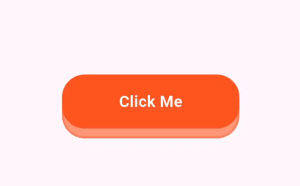

# 🟦 animated_3D_button

[](https://pub.dev/packages/animated_button)
[](LICENSE)

A customizable animated button widget for Flutter that creates a bouncing elevation/shadow effect using `Stack` and `AnimatedPositioned`.

<p align="center">
  
</p>

---

## ✨ Features

- Smooth animated shadow/elevation effect
- Custom size, color, and border radius
- Haptic feedback on press
- Lightweight and dependency-free

---

## 📦 Installation

Add this to your `pubspec.yaml`:

```yaml
dependencies:
  animated_3d_button: ^1.0.0
```

Then run:

```bash
flutter pub get
```

---

## 🚀 Usage

```dart
import 'package:animated_button/animated_button.dart';

AnimatedShadowButton(
  width: 180,
  height: 55,
  color: Colors.deepOrange,
  onPressed: () {
    // Handle tap
  },
  child: const Text(
    'Click Me',
    style: TextStyle(
      color: Colors.white,
      fontSize: 16,
      fontWeight: FontWeight.bold,
    ),
  ),
);
```

---

## 🧪 Example

A full working example is available in the [example](example/lib/main.dart) directory.

To run it:

```bash
cd example
flutter run
```

---

## 🧰 API Reference

| Property       | Type              | Default       | Description                                |
|----------------|-------------------|---------------|--------------------------------------------|
| `onPressed`    | `VoidCallback`     | **required**  | Callback fired on button press             |
| `child`        | `Widget`           | **required**  | The inner content of the button            |
| `width`        | `double`           | `150`         | Button width                               |
| `height`       | `double`           | `50`          | Button height                              |
| `color`        | `Color`            | `Colors.blue` | Background color of the button             |

---

## 🔧 Contributing

Feel free to submit issues or PRs. For major changes, open a discussion first.

---

## 📄 License

MIT © [Saptarshi Mondal](https://github.com/imSap)